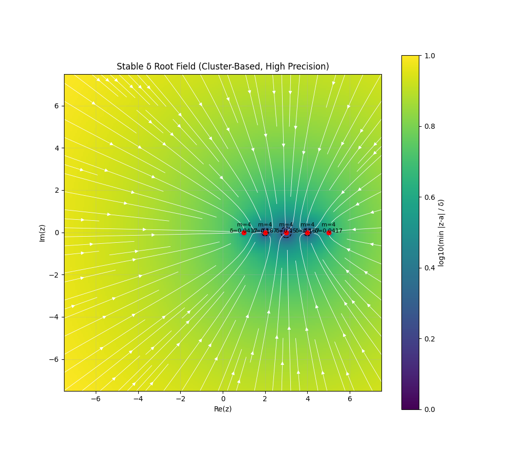

# A Triplet-Based Parameterization for the Local Asymptotic Characterization of Polynomial Roots



## Abstract

This paper introduces a compact three-parameter framework for characterizing the local geometry of polynomial roots. For each root, the framework records its position, its algebraic multiplicity, and a newly defined quantity called the characteristic deflection distance. This third parameter acts as a natural geometric scale: it measures how sharply or gradually the polynomial departs from zero in the immediate vicinity of the root, and it encodes the collective influence of all other roots through their distances from the one being analyzed.

The characteristic deflection distance generalizes the classical condition number of a simple root to roots of arbitrary multiplicity, and it allows direct geometric comparison across roots of different degrees. A key finding is that multiplicity alone does not determine geometric dominance — a lower-multiplicity root can have a larger spatial footprint than a higher-multiplicity one, depending on the global root configuration.

Symbolic and numerical Python implementations are provided, along with a worked example. The framework extends naturally to polynomials over the complex numbers.

[](https://doi.org/10.5281/zenodo.19303726)

---

## 1. Definition of the Local Triplet

For a univariate polynomial $P(x) \in \mathbb{R}[x]$, a real root $a$ with algebraic multiplicity $m \ge 1$ can be characterized by a local parameterization triplet:

$$
\mathcal{T} = (a, m, \delta)
$$

This triplet encodes:

* the **location** of the root,
* its **topological order of contact**, and
* a **canonical spatial scale** governing the local geometry of the polynomial.

The defining property of this parameterization is that it induces a **local normalization** under which the polynomial assumes the universal asymptotic form:

$$
P(a + \delta t) \sim t^m
$$

---

## 2. Components and Calculation

### I. Root Location ($a$) and Multiplicity ($m$)

These are the standard algebraic invariants defined by the local factorization:

$$
P(x) = (x-a)^m Q(x), \quad Q(a) \neq 0
$$

---

### II. The Leading Asymptotic Coefficient ($\alpha$)

The coefficient $\alpha$ captures the leading-order behavior of the polynomial near the root and is given by:

$$
\alpha = \frac{P^{(m)}(a)}{m!} = Q(a)
$$

Thus, locally:
$$
P(x) = \alpha (x-a)^m + O\big((x-a)^{m+1}\big)
$$

---

### III. The Characteristic Deflection Distance ($\delta$)

The scale $\delta$ is defined as:

$$
\delta = |\alpha|^{-1/m}
$$

Equivalently:

$$
\delta = \left|\frac{m!}{P^{(m)}(a)}\right|^{1/m}
$$

This is the **natural scaling factor** such that:

$$
P(a + \delta t) = t^m + O(\delta t^{m+1})
$$

> The local normalization holds in a neighborhood whose radius is controlled by $(\delta)$ itself: for $(|t|=O(1))$, the $(t^m)$ term dominates whenever \(\delta\) is small relative to the scale set by the next non-zero Taylor coefficient.

---

## 3. Interpretation and Utility

The triplet $\mathcal{T}$ provides a localized metric for comparing the geometric "footprint" of roots across different degrees and multiplicities.

### **Geometric Stiffness**

* Small $\delta$ → rapid departure from the axis (stiff root)
* Large $\delta$ → extended flat region

---

### **Canonical Normalization**

The transformation:

$$
x = a + \delta t
$$

reduces the polynomial locally to:

$$
P(x) \sim t^m
$$

This identifies all roots of multiplicity $m$ with a single universal model.

---

### **Scale–Interaction Structure**

If:

$$
P(x) = (x-a)^m \prod_{k=1}^r (x - b_k)
$$

then:

$$
\alpha = \prod_{k=1}^r (a - b_k)
$$

and:

$$
\delta = \left|\prod_{k=1}^r (a - b_k)\right|^{-1/m}
$$

Thus:

* $\delta^{-m}$ is the product of distances to other roots
* $\delta$ acts as an inverse geometric mean separation

---

### **Conditioning Interpretation**

For a simple root $m = 1$:

$$
\delta = \frac{1}{|P'(a)|}
$$

Thus $\delta$ generalizes the classical condition number of a root to higher multiplicities.

---

### **Comparative Insight**

Multiplicity alone does not determine geometric dominance. A lower-multiplicity root may have a larger $$\delta$$ than a higher-multiplicity root depending on its interaction with surrounding roots.

---

## 4. Numerical Demonstration

We consider:

$$
P(x) = x^7 (x-1)^3 (x+1)^3 (x-3)^5 (x+3)^5
$$

and compare:

* \(a = 0\), \(m = 7\)
* \(a = 3\), \(m = 5\)

The computation yields $(\delta_0 \approx 0.208160)$ and $(\delta_3 \approx 0.010281)$, showing that despite its lower multiplicity, the root at \(a=3\) has a **smaller** geometric footprint due to its greater effective distance from the other roots.

---

## 5. Computational Implementation

### Version A — Symbolic

```python
import sympy as sp
import numpy as np
import matplotlib.pyplot as plt

def analyze_root_symbolic(P_expr, x, a, m):
    """
    Compute (a, m, delta, alpha) using exact derivatives.
    """
    Pm = sp.diff(P_expr, x, m)
    alpha = Pm.subs(x, a) / sp.factorial(m)
    alpha = float(alpha)
    
    delta = abs(alpha)**(-1.0 / m)
    
    return a, m, delta, alpha


def plot_local_behavior(P_func, a, m, delta, title):
    x_vals = np.linspace(a - 1.5*delta, a + 1.5*delta, 500)
    y_vals = P_func(x_vals)
    
    t_vals = (x_vals - a) / delta
    y_norm = P_func(a + delta * t_vals)
    
    fig, axes = plt.subplots(1, 2, figsize=(12, 5))
    
    # Original
    axes[0].plot(x_vals, y_vals)
    axes[0].axvline(a, linestyle='--')
    axes[0].axhline(0)
    axes[0].set_title(f"{title}\nOriginal (delta={delta:.4f})")
    
    # Normalized
    axes[1].plot(t_vals, y_norm, label="Normalized P")
    axes[1].plot(t_vals, t_vals**m, linestyle='--', label="t^m")
    axes[1].axhline(0)
    axes[1].set_title("Normalized coordinates")
    axes[1].legend()
    
    plt.tight_layout()
    plt.show()


# Polynomial definition
x = sp.symbols('x')
P_expr = (x**7)*(x-1)**3*(x+1)**3*(x-3)**5*(x+3)**5
P_func = sp.lambdify(x, P_expr, 'numpy')

roots = [(0,7), (3,5)]

print(f"{'a':<5} {'m':<5} {'alpha':<15} {'delta':<15}")
print("-"*45)

for a, m in roots:
    a_val, m_val, delta, alpha = analyze_root_symbolic(P_expr, x, a, m)
    print(f"{a_val:<5} {m_val:<5} {alpha:<15.6e} {delta:<15.6f}")
    
    plot_local_behavior(P_func, a_val, m_val, delta,
                        title=f"Root at a={a_val}, m={m_val}")
```

---

### Version B — Pure Numerical

```python
import numpy as np
from math import factorial
import matplotlib.pyplot as plt

def analyze_root_numeric(coeffs, a, m):
    """
    coeffs: polynomial coefficients (highest degree first)
    """
    p = np.poly1d(coeffs)
    
    dp = p
    for _ in range(m):
        dp = np.polyder(dp)
    
    alpha = dp(a) / factorial(m)
    delta = abs(alpha)**(-1.0 / m)
    
    return a, m, delta, alpha


def plot_local_numeric(p, a, m, delta):
    x_vals = np.linspace(a - 1.5*delta, a + 1.5*delta, 500)
    y_vals = p(x_vals)
    
    t_vals = (x_vals - a) / delta
    y_norm = p(a + delta * t_vals)
    
    plt.figure(figsize=(6,4))
    plt.plot(t_vals, y_norm, label="Normalized P")
    plt.plot(t_vals, t_vals**m, linestyle='--', label="t^m")
    plt.legend()
    plt.title(f"Normalized root at a={a}")
    plt.axhline(0)
    plt.show()
```

---

## 6. Summary

The triplet $\mathcal{T} = (a, m, \delta)$ provides a complete **local asymptotic descriptor** of a polynomial root:

* $a$ — position
* $m$ — order of contact
* $\delta$ — intrinsic geometric scale

Together they define the canonical normalization:

$$
P(a + \delta t) = t^m + O(\delta t^{m+1})
$$

Thus, every root is locally equivalent—up to translation and scaling—to the universal model:

$$
t^m
$$

with $\delta$ acting as the **quantitative bridge between algebraic structure and geometric behavior**.

---

## 7. Extension to Complex Polynomials

The triplet $(\mathcal{T}=(a,m,\delta))$ with $(a\in\mathbb{C})$ generalizes verbatim to polynomials $(P\in\mathbb{C}[x])$. In the complex plane, $(\delta)$ acquires the interpretation of an *intrinsic disk radius*: inside the disk $(|z-a|\lesssim\delta)$, the local geometry is canonically equivalent to that of $(t^m)$ after the scaling $(z=a+\delta t)$. This viewpoint unifies real-root stiffness with classical complex-analytic notions of root clustering, perturbation radii, and numerical stability in the complex domain. All code implementations remain unchanged.
