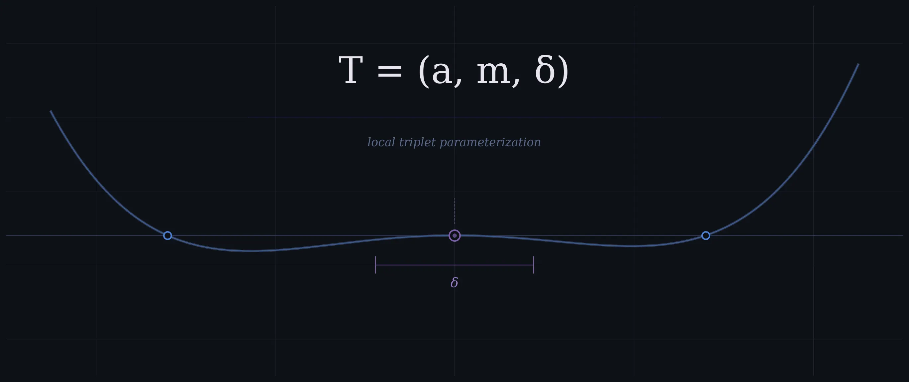

# A Triplet-Based Parameterization for the Local Asymptotic Characterization of Polynomial Roots

## Abstract

This paper introduces a compact three-parameter framework for characterizing the local geometry of polynomial roots. For each root, the framework records its position, its algebraic multiplicity, and a newly defined quantity called the characteristic deflection distance. This third parameter acts as a natural geometric scale: it measures how sharply or gradually the polynomial departs from zero in the immediate vicinity of the root, and it encodes the collective influence of all other roots through their distances from the one being analyzed.

The characteristic deflection distance generalizes the classical condition number of a simple root to roots of arbitrary multiplicity, and it allows direct geometric comparison across roots of different degrees. A key finding is that multiplicity alone does not determine geometric dominance — a lower-multiplicity root can have a larger spatial footprint than a higher-multiplicity one, depending on the global root configuration.

Symbolic and numerical Python implementations are provided, along with a worked example. The framework extends naturally to polynomials over the complex numbers.

---

## 1. Definition of the Local Triplet

For a univariate polynomial $P(x) \in \mathbb{R}[x]$, a real root $a$ with algebraic multiplicity $m \ge 1$ can be characterized by a local parameterization triplet:

$$
\mathcal{T} = (a, m, \delta)
$$

This triplet encodes:

* the **location** of the root,
* its **topological order of contact**, and
* a **canonical spatial scale** governing the local geometry of the polynomial.

The defining property of this parameterization is that it induces a **local normalization** under which the polynomial assumes the universal asymptotic form:

$$
P(a + \delta t) \sim t^m
$$

---

## 2. Components and Calculation

### I. Root Location ($a$) and Multiplicity ($m$)

These are the standard algebraic invariants defined by the local factorization:

$$
P(x) = (x-a)^m Q(x), \quad Q(a) \neq 0
$$

---

### II. The Leading Asymptotic Coefficient ($\alpha$)

The coefficient $\alpha$ captures the leading-order behavior of the polynomial near the root and is given by:

$$
\alpha = \frac{P^{(m)}(a)}{m!} = Q(a)
$$

Thus, locally:
$$
P(x) = \alpha (x-a)^m + O\big((x-a)^{m+1}\big)
$$

---

### III. The Characteristic Deflection Distance ($\delta$)

The scale $\delta$ is defined as:

$$
\delta = |\alpha|^{-1/m}
$$

Equivalently:

$$
\delta = \left|\frac{m!}{P^{(m)}(a)}\right|^{1/m}
$$

This is the **natural scaling factor** such that:

$$
P(a + \delta t) = t^m + O(\delta t^{m+1})
$$

> The local normalization holds in a neighborhood whose radius is controlled by $(\delta)$ itself: for $(|t|=O(1))$, the $(t^m)$ term dominates whenever \(\delta\) is small relative to the scale set by the next non-zero Taylor coefficient.

---

## 3. Interpretation and Utility

The triplet $\mathcal{T}$ provides a localized metric for comparing the geometric "footprint" of roots across different degrees and multiplicities.

### **Geometric Stiffness**

* Small $\delta$ → rapid departure from the axis (stiff root)
* Large $\delta$ → extended flat region

---

### **Canonical Normalization**

The transformation:

$$
x = a + \delta t
$$

reduces the polynomial locally to:

$$
P(x) \sim t^m
$$

This identifies all roots of multiplicity $m$ with a single universal model.

---

### **Scale–Interaction Structure**

If:

$$
P(x) = (x-a)^m \prod_{k=1}^r (x - b_k)
$$

then:

$$
\alpha = \prod_{k=1}^r (a - b_k)
$$

and:

$$
\delta = \left|\prod_{k=1}^r (a - b_k)\right|^{-1/m}
$$

Thus:

* $\delta^{-m}$ is the product of distances to other roots
* $\delta$ acts as an inverse geometric mean separation

---

### **Conditioning Interpretation**

For a simple root $m = 1$:

$$
\delta = \frac{1}{|P'(a)|}
$$

Thus $\delta$ generalizes the classical condition number of a root to higher multiplicities.

---

### **Comparative Insight**

Multiplicity alone does not determine geometric dominance. A lower-multiplicity root may have a larger $$\delta$$ than a higher-multiplicity root depending on its interaction with surrounding roots.

---

## 4. Numerical Demonstration

We consider:

$$
P(x) = x^7 (x-1)^3 (x+1)^3 (x-3)^5 (x+3)^5
$$

and compare:

* \(a = 0\), \(m = 7\)
* \(a = 3\), \(m = 5\)

The computation yields $(\delta_0 \approx 0.208160)$ and $(\delta_3 \approx 0.010281)$, showing that despite its lower multiplicity, the root at \(a=3\) has a **smaller** geometric footprint due to its greater effective distance from the other roots.

---

## 5. Computational Implementation

### Version A — Symbolic

See:
param_poly_root_sym.py

---

### Version B — Pure Numerical

See:
param_poly_root_num.py

---

## 6. Summary

The triplet $\mathcal{T} = (a, m, \delta)$ provides a complete **local asymptotic descriptor** of a polynomial root:

* $a$ — position
* $m$ — order of contact
* $\delta$ — intrinsic geometric scale

Together they define the canonical normalization:

$$
P(a + \delta t) = t^m + O(\delta t^{m+1})
$$

Thus, every root is locally equivalent—up to translation and scaling—to the universal model:

$$
t^m
$$

with $\delta$ acting as the **quantitative bridge between algebraic structure and geometric behavior**.

---

## 7. Extension to Complex Polynomials

The triplet $(\mathcal{T}=(a,m,\delta))$ with $(a\in\mathbb{C})$ generalizes verbatim to polynomials $(P\in\mathbb{C}[x])$. In the complex plane, $(\delta)$ acquires the interpretation of an *intrinsic disk radius*: inside the disk $(|z-a|\lesssim\delta)$, the local geometry is canonically equivalent to that of $(t^m)$ after the scaling $(z=a+\delta t)$. This viewpoint unifies real-root stiffness with classical complex-analytic notions of root clustering, perturbation radii, and numerical stability in the complex domain. All code implementations remain unchanged.

---

## 8. Global Visualization: Newton Flow and $\delta$-Root Fields

To visualize the global interaction of these triplets, we map the **$\delta$-Normalized Distance Field** and the **Newton Flow**. This provides a "topographical" view of the polynomial's geometry where every root is evaluated against its own intrinsic scale.

>Section 8 extends the δ-based framework by introducing a δ-normalized distance field arising directly from the underlying local normalization. This construction depends solely on δ and induces a scale-invariant geometric representation of the root configuration, in which the multiplicative aggregation encoded in δ manifests as normalized spatial dominance.

### **Mathematical Definition**

1. **Normalized Distance Field**: A scalar field representing the minimum logarithmic distance to any root, normalized by that root's specific $\delta$ scale. This allows for a scale-invariant comparison of roots with vastly different "stiffness"

    $$\text{Field}(z) = \log_{10} \left( \min_{i} \frac{|z - a_i|}{\delta_i} \right)$$

    The contour where the field value is $0$ corresponds to the boundary of the $\delta$-disks.

2. **Newton Flow**: The continuous vector field representing the trajectories of the Newton-Raphson method.

    $$\vec{V}(z) = -\frac{P(z)}{P'(z)}$$

### **Implementation**

This script uses `mpmath` for arbitrary-precision arithmetic, ensuring that the $\delta$ values and flow lines remain accurate even for high-multiplicity clusters where standard floats fail.

### **Observation**

In the resulting visualization, the streamlines reveal the basin of attraction for each root, while the background color reveals the **geometric footprint**. Notably, roots with larger $\delta$ values tend to exert a wider spatial influence on the distance field, even when their multiplicity $m$ is lower than that of nearby roots.

This behavior reflects a general structural property of the δ-normalized field:

### **Geometric Principle (δ-Weighted Influence)**

The δ-normalized Newton field induces a scale-weighted basin geometry in which each root acts as a center of attraction whose effective influence is governed not by multiplicity alone, but by a global interaction scale encoded in δ.

### **Corollary (Non-Dominance of Multiplicity)**

Algebraic multiplicity alone does not determine the spatial extent of a root’s basin of influence. In particular, a root of lower multiplicity may dominate a larger region of the δ-normalized field than a higher-multiplicity root, depending on the global configuration of roots.

### Computational Implementation

See:
root_field.py

Here is a concise, rigorous closing remark you can append directly:

---

## Conceptual Position

The triplet

$$
T = (a, m, \delta)
$$

is defined via

$$
\delta = |\alpha|^{-1/m}, \quad \alpha = \frac{P^{(m)}(a)}{m!}
$$

and is therefore invariant under phase transformations

$$
\alpha \mapsto e^{i\theta}\alpha.
$$

This is intentional: the construction isolates the **intrinsic geometric scale** of a root while quotienting out orientation (sign in the real case, phase in the complex case), which does not affect the local asymptotic magnitude.

Phase information can be recovered independently via

$$
\theta = \arg(\alpha),
$$

without modifying the triplet.

**Thus, the triplet is the maximal phase-invariant local descriptor of a polynomial root.**

---
